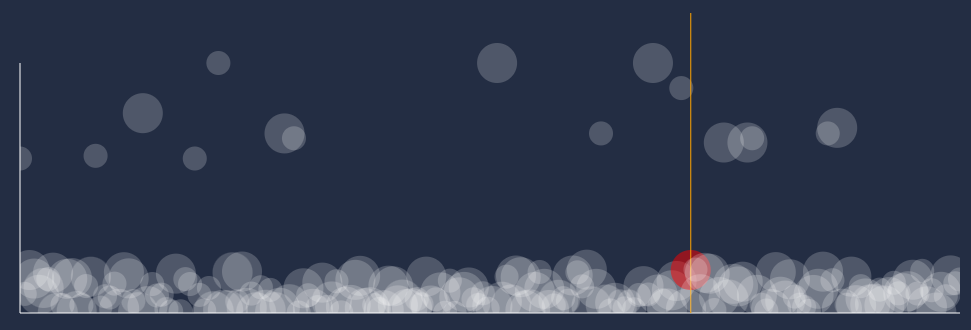

# Prevalence chart sample

[Live demo here](https://dsuarezv.github.io/prevalence-js)

Just a quick chart hacked together with React + svg. 

Good to detect outliers with low occurrence thanks to the logarithmic scale in the Y axis. Inspired by Chronicle.

In epidemiology, prevalence is the proportion of a particular population found to be affected by a medical condition at a specific time. 
In infosec, this metric can be used to detect events not related to normal organization activity, outliers. This chart is a fine way to visualize events that don't happen very often, they bubble up to the top (low prevalence).